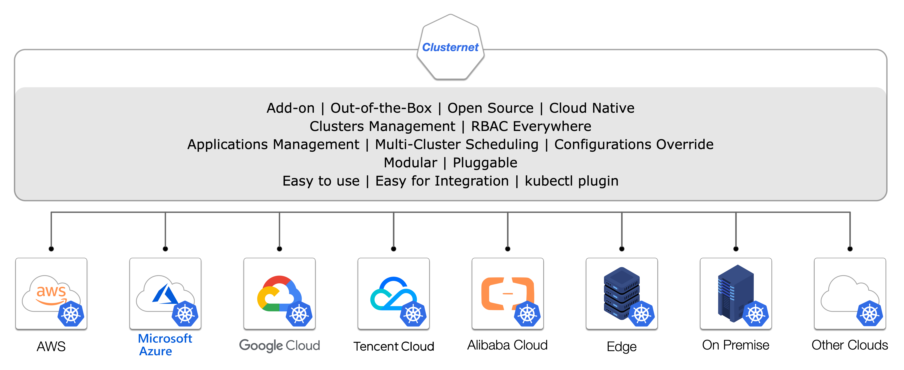
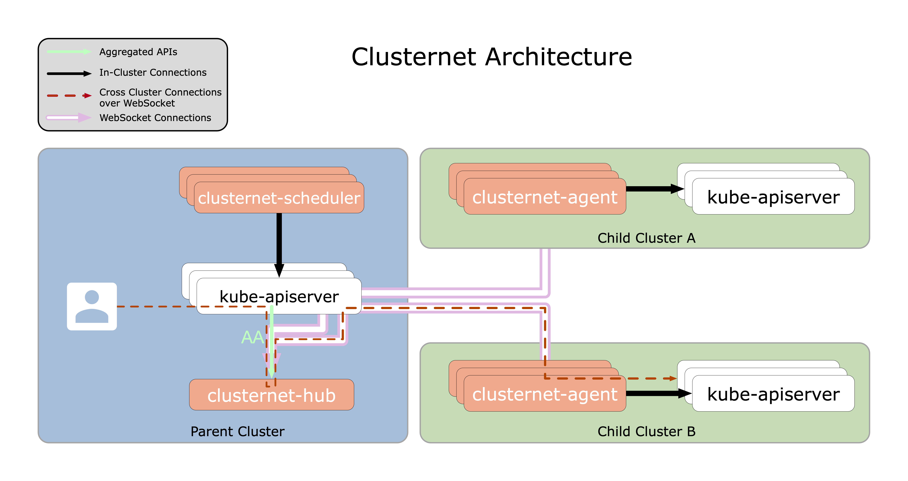
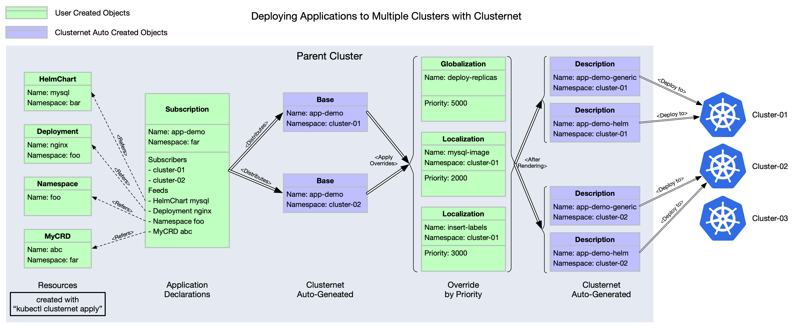

----

Managing Your Clusters (including public, private, hybrid, edge, etc) as easily as Visiting the Internet.

Out of the Box.

----

Clusternet (**Cluster** Inter**net**) is an open source ***add-on*** that helps you manage thousands of millions of
Kubernetes clusters as easily as visiting the Internet. No matter the clusters are running on public cloud, private
cloud, hybrid cloud, or at the edge, Clusternet helps setup network tunnels in a configurable way and lets you
manage/visit them all as if they were running locally. This also help eliminate the need to juggle different management
tools for each cluster.

**Clusternet can also help deploy and coordinate applications to multiple clusters from a single set of APIs in a
hosting cluster.**

Clusternet also provides a Kubernetes-styled API, where you can continue using the Kubernetes way, such as KubeConfig,
to visit a certain Managed Kubernetes cluster, or a Kubernetes service.

Clusternet is multiple platforms supported now, including `linux/amd64`, `linux/arm64`, `linux/ppc64le`, `linux/s390x`
, `linux/386` and `linux/arm`;

----

- [Core Features](#core-features)
- [Architecture](#architecture)
- [Concepts](#concepts)
- [Kubernetes Version Skew](#kubernetes-version-skew)
- [Getting Started](#getting-started)
    - [Installing Clusternet](#installing-clusternet)
    - [Checking Cluster Registration](#checking-cluster-registration)
    - [Visiting Managed Clusters With RBAC](#visiting-managed-clusters-with-rbac)
    - [How to Interact with Clusternet](#how-to-interact-with-clusternet)
    - [Deploying Applications to Multiple Clusters](#deploying-applications-to-multiple-clusters)
- [Contact](#contact)
- [Contributing & Developing](#contributing--developing)

----

# Core Features

- Kubernetes Multi-Cluster Management and Governance
    - managing Kubernetes clusters running in cloud providers, such as AWS, Google Cloud, Tencent Cloud, Alibaba Cloud,
      etc
    - managing on-premise Kubernetes clusters
    - managing any [Certified Kubernetes Distributions](https://www.cncf.io/certification/software-conformance/), such
      as [k3s](https://github.com/k3s-io/k3s)
    - managing Kubernetes clusters running at the edge
    - parent cluster can also register itself as child cluster to run workloads
    - managing Kubernetes version skewed from v1.17.x to v1.22.x,
      refering [Kubernetes Version Skew](#kubernetes-version-skew) for details
    - visiting any managed clusters with dynamic RBAC rules
      refering [this tutorial](./docs/tutorials/visiting-child-clusters-with-rbac.md) for details
- Application Coordinations
    - Cross-Cluster Scheduling
        - cluster label selectors
        - cluster taints & tolerations
    - Various Resource Types
        - Kubernetes native objects, such as `Deployment`, `StatefulSet`, etc
        - CRD
        - helm charts
    - [Setting Overrides](https://github.com/clusternet/clusternet/blob/main/docs/tutorials/deploying-applications-to-multiple-clusters.md#setting-overrides)
        - two-stage priority based override strategies
        - easy to rollback
        - cross-cluster canary rollout
- CLI
    - providing a kubectl plugin, which can be installed with `kubectl krew install clusternet`
    - consistent user experience with `kubectl`
    - create/update/watch/delete multi-cluster resources
    - interacting with any child clusters the same as local cluster
- Client-go
    - easy to integrate via
      a [client-go wrapper](https://github.com/clusternet/clusternet/blob/main/examples/clientgo/READEME.md)

# Architecture

Clusternet is a lightweight addon that consists of three components, `clusternet-agent`, `clusternet-scheduler`
and `clusternet-hub`.

`clusternet-agent` is responsible for

- auto-registering current cluster to a parent cluster as a child cluster, which is also been called `ManagedCluster`;
- reporting heartbeats of current cluster, including Kubernetes version, running platform, `healthz`/`readyz`/`livez`
  status, etc;
- setting up a websocket connection that provides full-duplex communication channels over a single TCP connection to
  parent cluster;

`clusternet-scheduler` is responsible for

- scheduling resources/feeds to matched child clusters based on `SchedulingStrategy`;

`clusternet-hub` is responsible for

- approving cluster registration requests and creating dedicated resources, such as namespaces, serviceaccounts and RBAC
  rules, for each child cluster;
- serving as an **aggregated apiserver (AA)**, which is used to serve as a websocket server that maintain multiple
  active websocket connections from child clusters;
- providing Kubernstes-styled API to redirect/proxy/upgrade requests to each child cluster;
- coordinating and deploying applications to multiple clusters from a single set of APIs;

> :pushpin: :pushpin: Note:
>
> Since `clusternet-hub` is running as an AA, please make sure that parent apiserver could visit the
> `clusternet-hub` service.

# Concepts

For every Kubernetes cluster that wants to be managed, we call it **child cluster**. The cluster where child clusters
are registerring to, we call it **parent cluster**.

`clusternet-agent` runs in child cluster, while `clusternet-scheduler` and `clusternet-hub` runs in parent cluster.

- `ClusterRegistrationRequest` is an object that `clusternet-agent` creates in parent cluster for child cluster
  registration.
- `ManagedCluster` is an object that `clusternet-hub` creates in parent cluster after
  approving `ClusterRegistrationRequest`.
- `HelmChart` is an object contains a [helm chart](https://helm.sh/docs/topics/charts/) configuration.
- `Subscription` defines the resources that subscribers want to install into clusters. Various `SchedulingStrategy` are
  supported, such as `Replication`, `Rebalancing` (implementing), etc. For every matched cluster, a corresponding `Base`
  object will be created in its dedicated namespace.
- `Clusternet` provides a ***two-stage priority based*** override strategy. `Localization` and `Globalization` will
  define the overrides with priority, where lower numbers are considered lower priority. `Localization` is
  namespace-scoped resource, while `Globalization` is cluster-scoped. Refer to
  [Deploying Applications to Multiple Clusters](#deploying-applications-to-multiple-clusters) on how to use these.
- `Base` objects will be rendered to `Description` objects with `Globalization` and `Localization` settings applied.
  `Description` is the final resources to be deployed into target child clusters.

# Kubernetes Version Skew

`Clusternet` is compatible with multiple Kubernetes versions. For example, you could run `clusternet-hub` with
Kubernetes v1.20.8, while the versions of child Kubernetes clusters could range from v1.18.x to v1.22.x.

| Version                  | Kubernetes v1.17.x | Kubernetes v1.18.x | Kubernetes v1.19.x | Kubernetes v1.20.x | Kubernetes v1.21.x | Kubernetes v1.22.x |
| ------------------------ | ------------------ | ------------------ | ------------------ | ------------------ | ------------------ | ------------------ |
| Clusternet v0.5.0        | \*                 | \*                 | ✓                  | ✓                  | ✓                  | ✓                  |
| Clusternet v0.6.0        | \*                 | ✓                  | ✓                  | ✓                  | ✓                  | ✓                  |
| Clusternet v0.7.0        | \*                 | ✓                  | ✓                  | ✓                  | ✓                  | ✓                  |
| Clusternet HEAD (main)   | \*                 | ✓                  | ✓                  | ✓                  | ✓                  | ✓                  |

Note:

* `✓` Clusternet is compatible with this Kubernetes version.
* `*` Clusternet has no guarantees to support this Kubernetes version. More compatible tests will be needed.

# Getting Started

## Installing Clusternet

You can try below ways to

- [install `Clusternet` with Helm](./docs/tutorials/installing-clusternet-with-helm.md)
- [install `Clusternet` the Hard Way](./docs/tutorials/installing-clusternet-the-hard-way.md)

> :whale: :whale: :whale: Note:
>
> The container images are hosted on both [ghcr.io](https://github.com/orgs/clusternet/packages) and [dockerhub](https://hub.docker.com/u/clusternet).
> Please choose the fastest image registry to use.

## Checking Cluster Registration

After `clusternet-hub` is successfully installed. You can try to install `clusternet-agent` to any Kubernetes clusters
you want to manage.

Please follow [this guide](./docs/tutorials/checking-cluster-registration.md) to check cluster registrations.

## Visiting Managed Clusters With RBAC

:white_check_mark: ***Clusternet supports visiting all your managed clusters with RBAC directly from parent cluster.***

Please follow [this guide](./docs/tutorials/visiting-child-clusters-with-rbac.md) to visit your managed clusters.

## How to Interact with Clusternet

Clusternet has provided two ways to help interact with Clusternet.

- kubectl plugin [kubectl-clusternet](https://github.com/clusternet/kubectl-clusternet)
- [use client-go to interact with Clusternet](https://github.com/clusternet/clusternet/blob/main/examples/clientgo/READEME.md)

## Deploying Applications to Multiple Clusters

Clusternet supports deploying applications to multiple clusters from a single set of APIs in a hosting cluster.

Please follow [this guide](./docs/tutorials/deploying-applications-to-multiple-clusters.md) to deploy your applications
to multiple clusters.

# Contact

If you've got any questions, please feel free to contact us with following ways:

- [open a github issue](https://github.com/clusternet/clusternet/issues/new/choose)
- [mailing list](mailto:clusternet@googlegroups.com)
- [join discussion group](https://groups.google.com/g/clusternet)

# Contributing & Developing

If you want to get participated and become a contributor to Clusternet, please don't hesitate to refer to our
[CONTRIBUTING](CONTRIBUTING.md) document for details.

A [developer guide](./docs/developer-guide.md) is ready to help you

- build binaries for all platforms, such as `darwin/amd64`, `linux/amd64`, `linux/arm64`, etc;
- build docker images for multiple platforms, such as `linux/amd64`, `linux/arm64`, etc;
