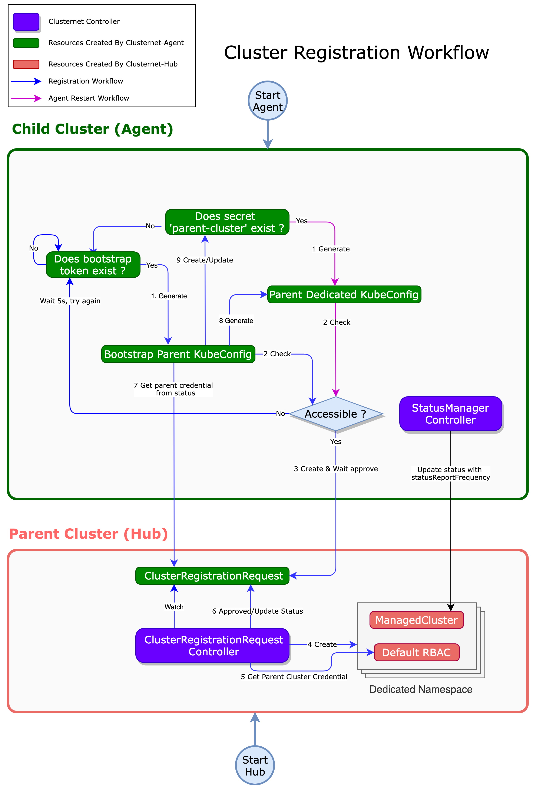

# Cluster Registration Workflow

Registering a cluster in Clusternet is similar to joining a new node to Kubernetes.

The basic registration process is that the child cluster sends a registration request to the parent cluster, and the parent cluster will approve the registration request. When the cluster registration success, the child cluster will periodically send its heartbeat information to the parent cluster.

## Architecture

## Workflow

There are 2 core concepts for the cluster registration workflow:

- `Hub` is the controller running on the parent cluster to handle cluster registration requests. It is responsible for approving registration requests and creating necessary resources for the registered clusters.
- `Agent` is the controller running on the child cluster to register its cluster to parent cluster. It also periodically sends child clusters' status as heartbeat to the parent cluster.

> :pushpin: :pushpin: Note:
>
> The bootstrap token should be created on the parent cluster before starting the agent controller.
> If the bootstrap token is not created or outdated, the child cluster will not be able to register to the parent cluster.

1. [Agent] If the `parent-cluster` secret exists in the `clusternet-system` namespace.
2. [Agent] Generate `parent dedicated kubeconfig`
   - If the `parent-cluster` exists, use it.
   - If the `parent-cluster` does not exist, use the bootstrap token.
3. [Agent] Create `ClusterRegistrationRequest` in the parent cluster using the `parent dedicated kubeconfig`, and wait for the request to be approved.
4. [Hub] ClusterRegistrationRequest controller watches the `ClusterRegistrationRequest` resource, and then create necessary resources `ManagedCluster`, `Dedicated Namespace` and `Default RBAC` rules.
   - `ManagedCluster` is the registered cluster object, it stores the status and ID of the registered cluster.
   - `Dedicated Namespace` is the namespace dedicated to the registered cluster.
   - `Default RBAC` is the default RBAC rule for the registered cluster access to the parent cluster.
5. [Hub] Get the access credentials of the parent cluster for the child cluster. This credential from `kubernetes.io/service-account-toke` type secret in the dedicated namespace, named `clusternet-xxxxx-token-yyyyy`.
6. [Hub] Approve and update the status in the `ClusterRegistrationRequest` resources including:
   - `Results`, if all above `steps[4-5]` have been created and ready, the result will be approved.
   - `DedicatedToke` is the `data.token` in `step 5` secret.
   - `CACertificate` is the `data.ca.crt` in `step 5` secret.
7. [Agent] Get parent cluster credential from `ClusterRegistrationRequest` status.
8. [Agent] Update parent cluster credential to `parent-cluster` secret.

After the registration, the StatusManager will continue reporting the child cluster status to the hub as defined in `statusReportFrequency`.
