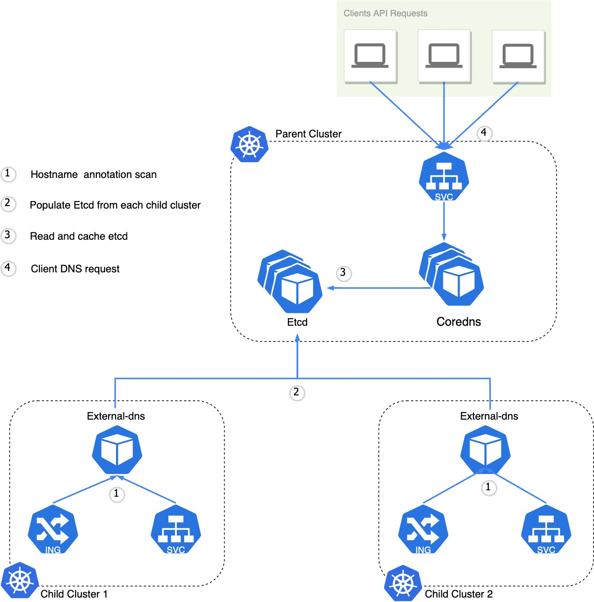

# Use External-DNS to Manage Multi-cluster Service DNS In Bare-metal Cluster

This tutorial describes how to setup ExternalDNS  that makes use of [CoreDNS](https://github.com/coredns/coredns) and [nginx ingress controller](https://github.com/kubernetes/ingress-nginx). You need to:

- install external-dns with coredns as a provider
- install ingress controller and metalLB


<div align="center"></div>

## 1. Setting up ExternalDNS for CoreDNS

​	Please follow [Setting up ExternalDNS for CoreDNS with minikube](https://github.com/kubernetes-sigs/external-dns/blob/master/docs/tutorials/coredns.md) to set up externalDNS for coreDNS.

- You may need to [Install etcd with Helm V3 ](https://artifacthub.io/packages/helm/bitnami/etcd)

- we can disables etcd authentication to simplify.

  ```
  [root@master ~]# kubectl  exec -it my-release-etcd-client -- bash
  I have no name!@my-release-etcd-client:/opt/bitnami/etcd$ etcdctl auth disable
  Authentication Disabled
  ```

## 2. Install ingress controller and  MetalLB

- Ingress controller

  [Install nginx ingress controller](https://kubernetes.github.io/ingress-nginx/deploy/) in every child cluster to expose kubernetes service outside cluster.

- MetalLB：

  [Install metalLB](https://metallb.universe.tf/installation/)  in every child cluster  to manage external IP,  metalLB can assign an external IP for loadbalancer type service.

  ```
  root@cluster1-1:~# kubectl get svc -n ingress-nginx
  NAME                                 TYPE           CLUSTER-IP    EXTERNAL-IP    PORT(S)                      AGE
  ingress-nginx-controller             LoadBalancer   10.11.74.86   192.168.1.14   80:31915/TCP,443:31378/TCP   28d
  ingress-nginx-controller-admission   ClusterIP      10.11.49.74   <none>         443/TCP                      28d
  ```

  ```
  root@cluster2-1:~/lmxia# kubectl get svc -n ingress-nginx
  NAME                                 TYPE           CLUSTER-IP      EXTERNAL-IP    PORT(S)                      AGE
  ingress-nginx-controller             LoadBalancer   10.21.225.132   192.168.1.17   80:30346/TCP,443:31654/TCP   28d
  ingress-nginx-controller-admission   ClusterIP      10.21.249.249   <none>         443/TCP                      28d
  ```

## 3. Add ingress to each child cluster

```
apiVersion: networking.k8s.io/v1
kind: Ingress
metadata:
  name: my-nginx
  namespace: default
spec:
  ingressClassName: nginx
  rules:
  - host: nginx.cloud.example.org
    http:
      paths:
      - backend:
          service:
            name: my-nginx
            port:
              number: 80
        path: /
        pathType: Prefix
```

```
root@cluster2-1:~/lmxia# kubectl  get ing
NAME       CLASS   HOSTS                     ADDRESS        PORTS   AGE
my-nginx   nginx   nginx.cloud.example.org   192.168.1.17   80      17m
```

```
root@cluster1-1:~/lmxia# kubectl  get ing
NAME       CLASS   HOSTS                     ADDRESS        PORTS   AGE
my-nginx   nginx   nginx.cloud.example.org   192.168.1.14   80      17m
```

## 3. Testing resolve DNS

In the cluster where coredns install.

```
[root@master ~]# kubectl run -it --rm --restart=Never --image=infoblox/dnstools:latest dnstools
If you don't see a command prompt, try pressing enter.
dnstools# dig @192.168.1.153 -p 30053 nginx.cloud.example.org +short
192.168.1.17
dnstools# dig @192.168.1.153 -p 30053 nginx.cloud.example.org +short
192.168.1.14
```

Now we can resolve out the two external IPs of the service deployed over multi-clusters.


